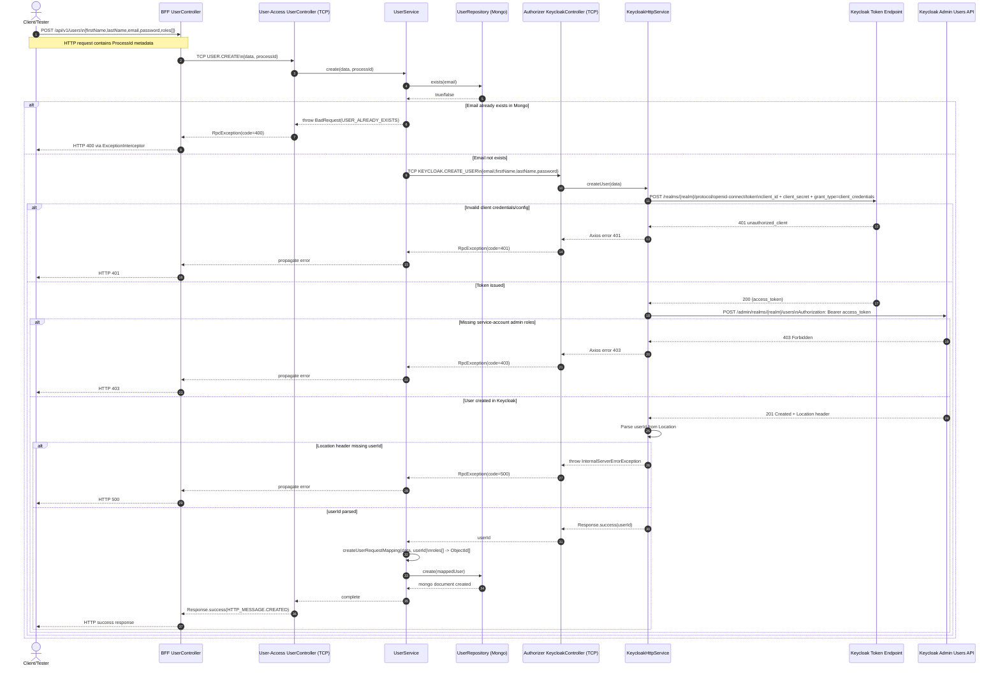

# User Creation Flow (BFF -> User Access -> Authorizer -> Keycloak)

## Runtime Preconditions

- `KEYCLOAK_HOST`, `KEYCLOAK_REALM`, `KEYCLOAK_CLIENT_ID`, `KEYCLOAK_CLIENT_SECRET` must match the running Keycloak realm and client.
- The service-account token used by `client_credentials` must have permission to call `POST /admin/realms/{realm}/users`.
- MongoDB must be reachable for `exists(email)` and `create(user)` in UserRepository.

## Important Note About Flows

- Browser login URL `/protocol/openid-connect/auth?response_type=code...` validates Authorization Code flow only.
- This create-user backend flow uses Client Credentials flow (`grant_type=client_credentials`), so it can still fail even when Authorization Code works.

## Code Paths Referenced

- `apps/bff/src/app/modules/user/controllers/user.controller.ts`
- `apps/user-access/src/app/modules/user/controllers/user.controller.ts`
- `apps/user-access/src/app/modules/user/services/user.service.ts`
- `apps/user-access/src/app/modules/user/repositories/user.repository.ts`
- `apps/user-access/src/app/modules/user/mapper/user-request.mapper.ts`
- `apps/authorizer/src/app/keycloak/controllers/keycloak.controller.ts`
- `apps/authorizer/src/app/keycloak/services/keycloak-http.service.ts`
- `libs/interceptors/src/lib/exception.interceptor.ts`
- `libs/interceptors/src/lib/tcpLogging.interceptor.ts`
